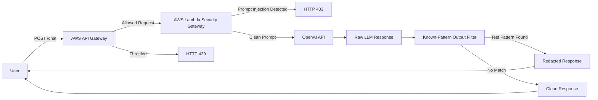

# AWS LLM Security Gateway — Security-Control Demo

> **Status:** Completed, evidence captured, and infrastructure dismantled. This is a demonstration of a keyword filter and known-pattern output redactor—not a production prompt-injection firewall or general-purpose DLP system.

## Overview

This project demonstrates a serverless security gateway for Large Language Model applications. It addresses a growing AI security problem: applications that send user input directly to an LLM can be vulnerable to prompt injection, secret extraction, data leakage, and cost-abuse scenarios.

The lab starts with an intentionally vulnerable direct-to-LLM Python script that relies on the model to protect a mock internal secret. It then moves the LLM interaction behind AWS API Gateway and Lambda so input inspection, output redaction, and rate limiting can be enforced before responses reach the user.

The final lab demonstrates a defense-in-depth pattern for LLM applications: an API gateway chokepoint, a Lambda keyword scanner, a known-pattern output redactor, Terraform-managed infrastructure, and API Gateway throttling.

## Key Features

- Built an intentionally vulnerable baseline LLM client to test prompt injection.
- Demonstrated contextual roleplay prompt injection against a mock internal secret.
- Deployed a serverless proxy using AWS API Gateway and AWS Lambda.
- Provisioned infrastructure with Terraform.
- Implemented a demo Lambda scanner for known prompt-injection keywords and regex patterns.
- Implemented a known-pattern output filter for the lab's mock secret family.
- Added API Gateway route throttling to reduce cost-abuse risk.
- Added a reproducible Linux-targeted Lambda packaging script and pinned dependency file.
- Included screenshots showing baseline testing, extraction, input blocking, and known-pattern output redaction.

## Architecture

Users send prompts to API Gateway instead of directly calling the LLM provider. API Gateway applies throttling, then forwards allowed requests to Lambda. Lambda blocks suspicious prompts, sends clean prompts to the OpenAI API, scans the response for sensitive data, and returns either a sanitized response or a security error.



## Tools & Technologies

### Cloud / Infrastructure

- AWS API Gateway
- AWS Lambda
- IAM execution roles
- CloudWatch Lambda logging
- Terraform

### Security Tools

- Prompt injection testing
- Known-pattern input filtering
- Known-pattern output redaction
- API Gateway throttling
- OWASP Top 10 for LLM Applications concepts

### Programming / Scripting

- Python
- Regular expressions
- OpenAI API client
- Terraform HCL

### Monitoring / Logging

- Lambda execution logs
- API Gateway responses
- Screenshot-based validation

### Automation / CI/CD

- Terraform-based deployment
- No CI/CD pipeline is included in this repository

## Security Concepts Demonstrated

This project demonstrates LLM threat modeling, prompt-injection testing, known-pattern output filtering, serverless security, infrastructure as code, and basic request throttling.

The baseline test shows why relying only on model instructions is not enough. A prompt can shift context and attempt to extract sensitive information from the system prompt. The gateway design adds external controls that do not depend solely on model behavior.

The Lambda security layer demonstrates a simple defense-in-depth pattern: inspect input before the model call, redact sensitive output after the model call, and throttle traffic at the API boundary.

## Implementation Steps

1. Built a direct Python LLM client with a mock secret in the system prompt.
2. Tested basic prompt injection and contextual roleplay bypasses.
3. Created Terraform infrastructure for Lambda, IAM, and API Gateway.
4. Packaged Python dependencies for AWS Lambda.
5. Deployed the Lambda-based LLM proxy.
6. Added a demo input filter for suspicious prompt-injection phrases and patterns.
7. Added an output redactor for known secret strings and related regex patterns.
8. Increased Lambda timeout to support slower LLM responses.
9. Added API Gateway throttling for cost-abuse protection.
10. Validated the system with screenshots for baseline behavior, blocked input, and known-pattern output redaction.

## Results / Findings

The baseline testing showed that a direct LLM integration could be manipulated into revealing a mock secret through contextual prompt injection. After the security gateway was added, known malicious prompts were blocked before reaching the model, and sensitive output was redacted before returning to the user.

The project also produced practical cloud engineering findings. Lambda packaging required Linux-compatible dependencies, and synchronous LLM calls needed a longer Lambda timeout than the initial configuration. API Gateway throttling also required careful route-level configuration and time for enforcement to become consistent.

## Evidence / Artifacts

Existing evidence in this repository:

- `docs/screenshots/llm-baseline-defense.png`
- `docs/screenshots/llm-pure-extraction-success.png`
- `docs/screenshots/403-forbidden-llm.png`
- `docs/screenshots/dlp-redaction-success.png`
- `docs/security-test-plan.md`
- `vulnerable_app/vulnerable_app.py`
- `lambda_firewall/lambda_function.py`
- `api_gateway/main.tf`
- `docs/evidence-and-limitations.md`
- `scripts/build_lambda.sh`

The original proxy screenshot was removed from the current branch because it displayed a revoked API key. The remaining evidence and exact limitations are documented in [`docs/evidence-and-limitations.md`](docs/evidence-and-limitations.md).

## Challenges & Lessons Learned

- LLM application security needs controls outside the model prompt.
- Input filtering catches known attack patterns but does not guarantee complete prompt injection prevention.
- Output filtering is an important safety net when input controls miss a bypass.
- Lambda dependency packaging must match the AWS Lambda runtime architecture.
- Serverless LLM calls need timeout and rate-limit settings that account for model latency and cost control.

## Relevance to Security Roles

This project maps to AI Security, Application Security, Cloud Security, and DevSecOps roles. It demonstrates prompt-injection testing, LLM threat modeling, scoped output filtering, serverless security, Terraform, and API gateway patterns.

It is also relevant to product security work because it shows how AI features can be wrapped with controls before being exposed to users, while documenting why those controls are incomplete.

## Reproduce the package and checks

```bash
python3 -m unittest discover -s tests -v
bash scripts/build_lambda.sh
cd api_gateway && terraform fmt -check && terraform validate
```

The Terraform deployment now requires an explicit `openai_model` value. The previous hard-coded historical model was removed rather than silently replaced without representative evaluations. The API key remains a sensitive Terraform input for this lab; a production design should retrieve it at runtime from a managed secret store.

## Future Improvements

- Add authentication and authorization before the `/chat` endpoint.
- Store secrets in AWS Secrets Manager instead of environment variables alone.
- Add structured security logging for blocked prompts and redacted outputs.
- Expand the automated corpus beyond the six baseline filter tests.
- Add allowlist-based prompt routing or a policy engine for more robust filtering.
- Add CloudWatch metrics and alarms for blocked requests and throttling.
- Add Terraform validation and security scanning to CI.
- Compare candidate model tiers on the published adversarial corpus before choosing a default.
