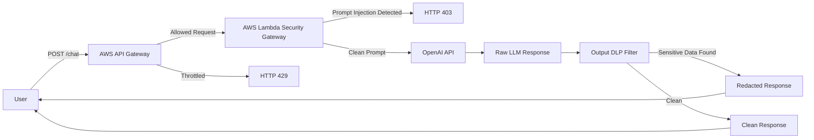

# AWS LLM Security Gateway and Prompt Injection Firewall

## Overview

This project demonstrates a serverless security gateway for Large Language Model applications. It addresses a growing AI security problem: applications that send user input directly to an LLM can be vulnerable to prompt injection, secret extraction, data leakage, and cost-abuse scenarios.

The lab starts with an intentionally vulnerable direct-to-LLM Python script that relies on the model to protect a mock internal secret. It then moves the LLM interaction behind AWS API Gateway and Lambda so input inspection, output redaction, and rate limiting can be enforced before responses reach the user.

The final system demonstrates defense-in-depth for LLM applications: an API gateway chokepoint, a Lambda-based input scanner, an outbound DLP filter, Terraform-managed infrastructure, and API Gateway throttling for denial-of-wallet protection.

## Key Features

- Built an intentionally vulnerable baseline LLM client to test prompt injection.
- Demonstrated contextual roleplay prompt injection against a mock internal secret.
- Deployed a serverless proxy using AWS API Gateway and AWS Lambda.
- Provisioned infrastructure with Terraform.
- Implemented a Lambda input scanner for prompt injection keywords and regex patterns.
- Implemented an output DLP filter to redact known sensitive strings and matching patterns.
- Added API Gateway route throttling to reduce cost-abuse risk.
- Packaged Python dependencies for Lambda and documented deployment troubleshooting.
- Included screenshots showing baseline testing, extraction, proxy success, input blocking, and DLP redaction.

## Architecture

Users send prompts to API Gateway instead of directly calling the LLM provider. API Gateway applies throttling, then forwards allowed requests to Lambda. Lambda blocks suspicious prompts, sends clean prompts to the OpenAI API, scans the response for sensitive data, and returns either a sanitized response or a security error.

## Tools & Technologies

### Cloud / Infrastructure

- AWS API Gateway
- AWS Lambda
- IAM execution roles
- CloudWatch Lambda logging
- Terraform

### Security Tools

- Prompt injection testing
- Input filtering
- Output DLP redaction
- API Gateway throttling
- OWASP Top 10 for LLM Applications concepts

### Programming / Scripting

- Python
- Regular expressions
- OpenAI API client
- Terraform HCL

### Monitoring / Logging

- Lambda execution logs
- API Gateway responses
- Screenshot-based validation

### Automation / CI/CD

- Terraform-based deployment
- No CI/CD pipeline is included in this repository

## Security Concepts Demonstrated

This project demonstrates LLM security, prompt injection testing, output filtering, data loss prevention, serverless security, infrastructure as code, and denial-of-wallet mitigation.

The baseline test shows why relying only on model instructions is not enough. A prompt can shift context and attempt to extract sensitive information from the system prompt. The gateway design adds external controls that do not depend solely on model behavior.

The Lambda security layer demonstrates a simple defense-in-depth pattern: inspect input before the model call, redact sensitive output after the model call, and throttle traffic at the API boundary.

## Implementation Steps

1. Built a direct Python LLM client with a mock secret in the system prompt.
2. Tested basic prompt injection and contextual roleplay bypasses.
3. Created Terraform infrastructure for Lambda, IAM, and API Gateway.
4. Packaged Python dependencies for AWS Lambda.
5. Deployed the Lambda-based LLM proxy.
6. Added an input firewall for suspicious prompt injection phrases and patterns.
7. Added an output DLP filter for known secret strings and related regex patterns.
8. Increased Lambda timeout to support slower LLM responses.
9. Added API Gateway throttling for cost-abuse protection.
10. Validated the system with screenshots for baseline, blocked input, successful proxy routing, and DLP redaction.

## Results / Findings

The baseline testing showed that a direct LLM integration could be manipulated into revealing a mock secret through contextual prompt injection. After the security gateway was added, known malicious prompts were blocked before reaching the model, and sensitive output was redacted before returning to the user.

The project also produced practical cloud engineering findings. Lambda packaging required Linux-compatible dependencies, and synchronous LLM calls needed a longer Lambda timeout than the initial configuration. API Gateway throttling also required careful route-level configuration and time for enforcement to become consistent.

## Screenshots

Existing screenshots in this repository:

- `docs/screenshots/llm-baseline-defense.png`
- `docs/screenshots/llm-pure-extraction-success.png`
- `docs/screenshots/serverless-proxy-success.png`
- `docs/screenshots/403-forbidden-llm.png`
- `docs/screenshots/dlp-redaction-success.png`

Suggested additional screenshots:

- `docs/screenshots/api-gateway-throttling.png`
- `docs/screenshots/lambda-cloudwatch-security-logs.png`
- `docs/screenshots/terraform-apply-success.png`
- `docs/screenshots/architecture.png`

## Challenges & Lessons Learned

- LLM application security needs controls outside the model prompt.
- Input filtering catches known attack patterns but does not guarantee complete prompt injection prevention.
- Output filtering is an important safety net when input controls miss a bypass.
- Lambda dependency packaging must match the AWS Lambda runtime architecture.
- Serverless LLM calls need timeout and rate-limit settings that account for model latency and cost control.

## Relevance to Security Roles

This project maps strongly to AI Security Engineer, Application Security Engineer, Cloud Security Engineer, and DevSecOps Engineer roles. It demonstrates prompt injection testing, LLM threat modeling, DLP design, serverless security, Terraform, and secure API gateway patterns.

It is also relevant to product security work because it shows how AI features can be wrapped with controls before being exposed to users.

## Future Improvements

- Add authentication and authorization before the `/chat` endpoint.
- Store secrets in AWS Secrets Manager instead of environment variables alone.
- Add structured security logging for blocked prompts and redacted outputs.
- Add automated tests for prompt injection and DLP cases.
- Add allowlist-based prompt routing or a policy engine for more robust filtering.
- Add CloudWatch metrics and alarms for blocked requests and throttling.
- Move packaged third-party dependencies out of source control and document the build process.
- Add a CI/CD workflow for Terraform validation and Python tests.
