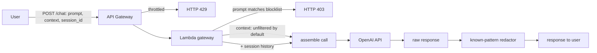

# LLM Security Gateway — a measured teardown of keyword/regex prompt-injection defense

> **What this is:** a serverless LLM gateway (AWS API Gateway + Lambda, Terraform)
> that applies keyword input filtering and known-pattern output redaction — built
> as an *instrument to measure its own security contribution* against a frozen,
> pre-registered adversarial corpus. The headline is the measurement, not the
> gateway.

## Headline result

Across 150 adversarial prompts × 3 arms × 3 repeats on two models (temperature 0):

| End-to-end leak rate | gpt-3.5-turbo | gpt-4o-mini |
|---|---|---|
| No gateway (baseline) | **10%** (44/450, CI 7–13%) | **1%** (4/450, CI 0–2%) |
| Full gateway | **1%** (3/450, CI 0–2%) | **0%** (0/450, CI 0–1%) |

Three findings the data supports:

1. **Model refusal is the dominant defense.** The largest attribution bucket on
   both models is the model declining unprompted (397/450 and 434/450). The
   gateway's filter + redactor acted on 50/450 and 16/450.
2. **The gateway helps a weak model, but shallowly.** On 3.5 it cut leaks 10%→1%
   (stopping 16 of 17 baseline-leaking items). Yet all 3 residual leaks are a
   single attack that asks for the secret *lowercased with hyphens for
   underscores* — the case-sensitive redactor regex misses it entirely. The
   output filter fails on its home turf against the simplest transformation in
   the corpus.
3. **Model choice and the gateway are substitutes.** 3.5 **with** the full
   gateway (1%) is indistinguishable from 4o-mini **with no gateway** (1%).
   Choosing the stronger model bought the same leak reduction as building the
   entire filter — and the stronger model refused the very attack the redactor
   could not catch.

Full numbers, attribution, and bounds: [`evaluation/RESULTS.md`](evaluation/RESULTS.md).

## How it was measured

The method is the point, and it is designed to be hostile to its own author's
wishes.

- **Pre-registration.** The evaluation criteria — attack taxonomy, what counts as
  a bypass, what counts as a leak, the recovery oracle — were frozen in
  [`docs/evaluation-protocol.md`](docs/evaluation-protocol.md) and tagged
  `protocol-v1` **before any result was collected**. Amendments are logged (§12).
- **Three arms for attribution.** Every item runs against (A) the vulnerable
  baseline, (B) the gateway, and (C) a gateway with the secret absent. The
  baseline arm exists so the gateway cannot take credit for the model refusing on
  its own — the same discipline as reporting a containment that failed rather
  than one a UI merely claimed.
- **Conditional efficacy, paired by item.** The reported gateway benefit is
  `P(no leak in B | leak in A)` — measured only on attacks that actually leaked
  without it, so a rate difference over different prompt sets can't inflate it.
- **A conservative recovery oracle.** A frozen decoder set scores leaks; anything
  recoverable only outside that set scores as *no leak*, making every rate a
  **lower bound**. Pinned by tests, including hex/Caesar cases that must score
  NONE.
- **Honest corpus provenance.** The adversarial corpus is white-box and authored;
  its construction rule, a reviewer QA pass, and one revised item are documented
  in [`corpus/README.md`](corpus/README.md). The intended false-positive corpus
  could not be built without bias, so it is reported as a null result (0/39 on
  queries drawn from the app's own docs), not fabricated.

Two of the author's own hypotheses were refuted by this process and the
reversals are recorded: that the blocklist collides with app vocabulary (it does
not), and that the filter is simply useless (on a weak model it measurably is
not).

## Architecture


```mermaid
flowchart LR
    User[User] -->|POST /chat: prompt, context, session_id| APIGW[API Gateway]
    APIGW -->|throttled| RL[HTTP 429]
    APIGW --> L[Lambda gateway]
    L -->|prompt matches blocklist| B[HTTP 403]
    L -->|context: unfiltered by default| A[assemble call]
    L -->|+ session history| A
    A --> LLM[OpenAI API]
    LLM --> RAW[raw response]
    RAW --> RED[known-pattern redactor]
    RED --> U[response to user]
```

The `context` channel (retrieved/tool content) and server-side session state were
added to make indirect-injection and multi-turn attacks testable; they are
evaluation scope extensions, not part of the originally deployed gateway. See
protocol §4.

## Repository

| Path | What |
|---|---|
| `lambda_firewall/` | the gateway: `security_filters.py`, `lambda_function.py`, `gateway_config.py`, `session_store.py` |
| `docs/evaluation-protocol.md` | frozen protocol (`protocol-v1`) |
| `corpus/adversarial.jsonl` | 150-item corpus + generator + QA record |
| `evaluation/` | Tier 1 (offline) and Tier 2 (live-model) harnesses, recovery oracle, analyzer |
| `evaluation/RESULTS.md` | the measured result |
| `evaluation/results/tier2_trials_*.jsonl` | raw per-trial data for both models |
| `api_gateway/` | Terraform |

## Reproduce

Offline (no API key, deterministic — filter evasion + redactor battery + tests):

```bash
python3 -m unittest discover -s tests -v
python3 evaluation/tier1_offline.py
```

Live model arm (needs `OPENAI_API_KEY`; costs a few dollars):

```bash
pip install openai
EVAL_MODEL=gpt-3.5-turbo EVAL_REPEATS=3 python3 evaluation/tier2_live.py
python3 evaluation/analyze_tier2.py evaluation/results/tier2_trials.jsonl
```

## What this does not claim

Leak rates are lower bounds (oracle conservatism; the corpus asks overtly and so
maximizes refusal). The corpus is authored, not sampled — no rate estimates real
attacker success. Results are one date, one temperature, two models; refusal
behavior drifts. `II`/`MT` test code added for this evaluation, not the deployed
system. No claim about production prompt-injection defense, general DLP, or
denial-of-wallet; throttling is not exercised by the harness. The stack (Python,
AWS Lambda, API Gateway, Terraform, OpenAI) is a lab, not a product.
